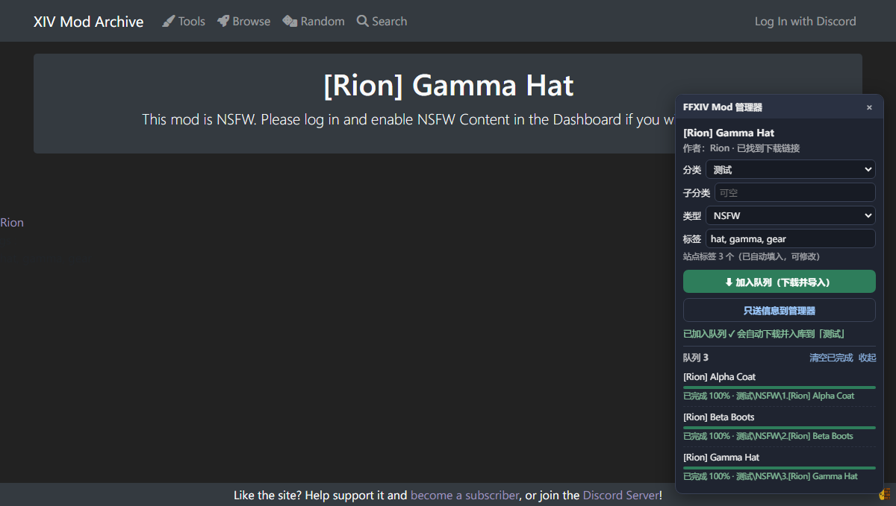
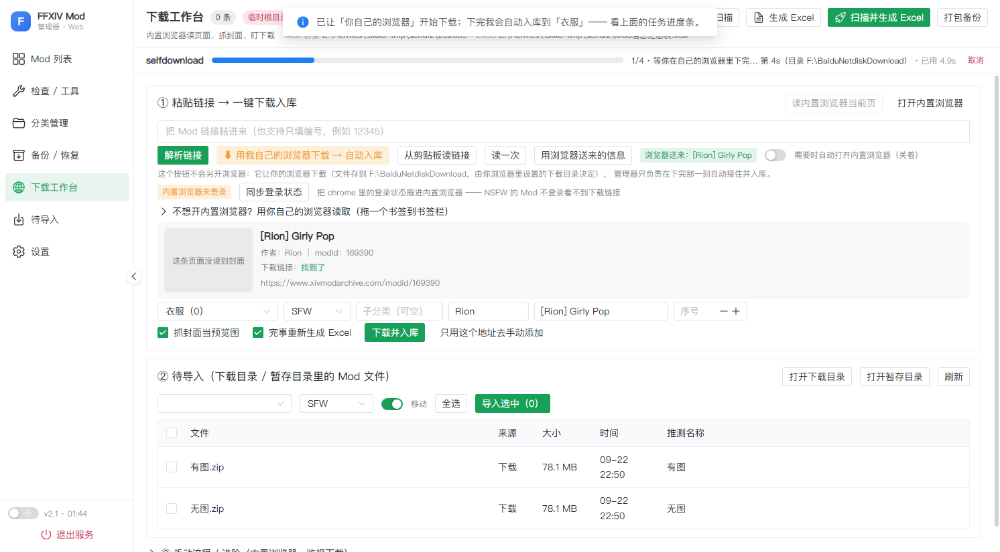

# FFXIV XMA Manager

给 **XIV Mod Archive（XMA）** 用的本地 Mod 管理工具：**爬下来的 Mod 自动解析、自动入库、自动生成 Excel 汇总表**，
配一个**游戏内插件**可以直接装进 Penumbra 并即时生效，再配一个**浏览器拓展**在 Mod 页面上一键「下载并导入」。

一句话理解这三件套的分工：

> **浏览器**负责下载（用你自己已登录的身份 → NSFW 也能下）·**管理器**负责接住并入库（写 地址.txt / 自动编号 / 抓封面 / 打标签 / 生成 Excel）·**插件**负责把 Mod 装进游戏。

---

## 三件套

| 目录 | 是什么 | 技术栈 |
|---|---|---|
| `manager/` | **ModManager**：本地 Web 管理器（列表 / 编辑 / 分类 / 标签 / 查重 / 下载工作台 / Excel 汇总） | Python 3.12（标准库 http.server）+ Vue 3 / Naive UI（Vite 构建） |
| `plugin/` | **ModBridge**：游戏内插件，管理器点「安装到游戏」→ 游戏内确认 → 装进 Penumbra 并即时生效（含预览图绘制） | C# / .NET 10 / Dalamud API 15 / Penumbra.Api |
| `browser-extension/` | **浏览器拓展**：XMA 页面右下角小面板，选分类/子分类/标签 → 加入队列 → 自动下载 + 自动入库 | Chrome MV3（原生 JS，无构建） |

> 接口契约自检：`python scripts/check_api_contract.py` —— 会核对「拓展 / 网页用到的 /api 路径」
> 与「后端真实注册的路由」、以及几个关键响应字段（比如 `/api/categories` 的 `disk_subcats`）。
> 改后端接口后跑一次，避免像 v2.18.0 那样把拓展在读的字段删掉。





---

## 主要功能

**管理器**
- 扫描 Mod 目录 → SQLite 索引 → 一键生成 **Excel 汇总表**（内嵌预览图）
- 列表 / 图片墙两种视图；多选批量改分类、类型、子分类、标签、**影响/替换**
- **筛选集中在一个「高级搜索」里**（点按钮进入）：名称／作者／影响替换／标签／分类／安装状态／
  标签有无／预览图 + 排序（含按更新时间）× 升降序；留空就是不看这个条件，改完立即生效
- **表格只列关键信息**（分类/子分类/序号/作者/类型/更新时间/名称/是否安装）；
  标签与影响/替换都在右侧详情里按项分开显示、可直接编辑
- 右侧详情**「操作」放最上面**：主动作两列等宽对齐（从站点更新／安装到游戏／上传新文件替换／补封面到游戏），
  文件类收成一行小字按钮（打开文件夹 · 复制路径 · 查看原图）→ 只占面板约 19% 高度，不再是主角；
  设置页按功能分成 5 块，保存按钮吸在底部
- **详情三档宽度**（操作卡右上角切换，或**双击列表任意一行**进「半屏」；Esc 逐级退回）：
  **窄栏**（默认 400px，边翻列表边看）／**半屏**（列表让出大半，详情约 60%）／**全屏**（详情铺满窗口）
- **详情布局照 XMA 的 mod 页分五个区**，两列宽度比 **5:2**（侧栏最窄 220px）；
  「描述 / 文件 / 历史」只在展开时显示，窄栏不占地方：
  左列 = ① 标题（名称 + 版本 + 分类说明 + 站点链接）② **大图轮播**（‹ › 切图 + 右下角计数 + 缩略图条）
  ③ **描述区**（页签：描述 / 文件 / 历史，仅展开时）；右列 = ④ **操作**（作者小卡 → 从站点更新 / 安装到游戏 /
  上传新文件替换 / 补封面到游戏 → 图片数·载荷大小·站点版本）⑤ **元信息**（分类·更新时间·发布日期·类型·影响替换·种族·性别·标签·地址）
- **种族 / 性别**来自站点上的 Races / Genders，**检查更新时自动带过来**（也能手改）；**发布日期**同理
- **「描述」**是本地可编辑字段（站点上的内容描述以后会自动带过来）；
  **「文件」**页签列 Mod 文件夹里的文件与大小，**点文件名就能下载**（浏览器直接存盘，大文件流式写）；
  **「历史」**页签直接读站点版本更新记录（版本 / 时间 / 更新说明）
- 「标签」「影响/替换」**长取值自动换行显示完整**，不会顶出面板被裁掉
- **云存储（夸克网盘）**：载荷（.pmp/.zip…）归档到夸克，**本地只留元数据 + 预览图 + 地址.txt**
  （实测把 28 条 mod 全量归档后，本地从 2850 MB 降到 284 MB）
  · **已归档的到处都带「☁」标识**：列表的名称列、**图片墙的标题**、详情标题 ——
    鼠标停上去能看到「N 个文件 ｜ 大小 ｜ 同步时间 ｜ 云端路径」
  · **归档**：整条 mod 的载荷树（含多层子目录里的变体包）上传 → **逐文件校验通过才删本地**（进回收站可还原）；
    云端已有同样的文件走**秒传**，不用重传
  · **不会重复备份**：归档前先查云端同名文件 —— 有且大小一致的直接复用（秒级跳过），
    所以重复点「归档到云盘」也不会在云端多存一份
  · **取回**：按需把云端载荷下载回本地，逐文件比对大小 + sha1；也可以只看不取 ——
    详情「文件」页签会列出**云端载荷**，点文件名就**在管理器里下载**：
    带进度条（已下载 / 总大小 / 百分比 / 速度）、可随时取消；支持「另存为」的浏览器会直接流式落盘
  · **「在网盘里打开」精准定位**：不是只打开网盘首页，而是直接停在该 Mod 的云端目录
    （后端解析目录 fid 后 302 到 `pan.quark.cn/list#/list/all/<fid>`，实测能定位）
  · **校验**：把云端那份整个下载回来逐个比对 sha1（只体检，不动本地）
  · **装进游戏会自动取回**：本地没有载荷时，自动从云端取回到暂存目录再交给插件，装完不留库内
  · 归档时会记下载荷的文件时间当「更新基线」，所以**归档后「检查更新」照样准**
  · 归档 / 取回 的入口只在**列表上方的工具栏**（作用于选中项或全部）；详情里只保留云状态 + 「校验云端」
  · ⚠ 走的是夸克 PC 端接口（**非官方**，改版可能失效）；Cookie 只存在本机 `mod_manager.json`，设置页有「测试连接 + Cookie 体检」
  · ⚠ **打包备份的语义变了**：载荷归档后，备份包只含元数据 + 图（实测 28 条：2.9 GB → 285 MB），
    恢复后本地没有载荷 —— 需要时点「从云盘取回」。备份包的 manifest 里写明了这件事
- 分类 & 子分类管理（目录即分类，页面上直接管）；按分类自动分配序号
  · 顶部概览：分类几个 / 磁盘上几个 / Mod 合计 / 子分类 / **空分类**（可以放心删的那些）
  · 树形列表：分类 + 它的子分类（子行带 `SFW`/`NSFW` 标签），可搜索、可一键展开/收起
  · 行内操作：↑ ↓ 调显示顺序（写进配置）｜ 改名 ｜ 新建子分类 ｜ 删除；
    子分类行有 定位 / 改名 / 删除
  · **在线管理**：分类和子分类都能改名（真的改磁盘文件夹，Mod 标签自动跟着走）和删除；
    子分类现在也能删/改名了（以前只能新建）。删除前会给出「X 条 Mod ｜ Y 个文件」，
    非空的必须勾一句「我知道这些会一起移入回收站」才能删 —— 走回收站，能还原
- 查重、安装检查（标记已装/未装）、检查报告
- **检查更新 / 更新 Mod**：读站点上的「最后更新时间」比对本地，有新版就在列表里标记；
  **顺手按站点刷新「标签」和「影响/替换」**（以站点为准，会覆盖本地手改值——这是主人定的规则），
  一键从站点下载最新版覆盖（旧文件进回收站，地址/编号/预览图/标签/影响替换 全保留）；
  也能**手动上传**新文件替换，不用重新走一遍入库
  · **只查 XMA / heliosphere 两个来源**：其它来源（或没填站点地址的）直接跳过，结果里写明「跳过 N 条」
- **再下一次同一个 Mod 会自动识别成「更新」**：同一个站点地址（modid）已在库里就覆盖那一条，
  不再新建重复条目 —— 浏览器拓展下载 NSFW 的更新也走这条路
- 站点支持：**XIVModArchive**（含版本号/更新说明）与 **heliosphere.app**（版本 + 更新时间；
  它的下载按钮调站内接口、拿不到直链，所以更新走「打开页面手动下载 → 上传替换」）
- 内置浏览器（CDP）抓页面信息：名称 / 作者 / 封面 / 画廊图 / **站点标签** / **影响/替换** / 下载直链
- 下载工作台：解析链接 → 下载 → 入库 → 抓封面 → 重扫 → 导 Excel，全流程带进度、可取消
  · 解析链接时会**先把内置浏览器导航到这条 Mod 的页面再读**（浏览器已在跑也照样跳过去），
    并核对 `modid` —— 以前浏览器开着别的那条时，会把**另一条 Mod** 的名称/直链读成这条
  · 内置浏览器**只在真的没启动**时才提示「没开」；已登录状态按站点真实的会话 Cookie 判断
  · 站点正文里带 emoji 也不会再把接口打挂（截断代理对 + 输出层双重兜底）
- **更新时间**：下载/更新时自动记下站点上的 `Last Version Update`（有版本历史的还带版本号与更新说明）
- **影响/替换**：这条 Mod 替换游戏里的哪件装备/哪个部位 —— 下载入库时自动读站点上的
  `Affects / Replaces`，也能在列表/编辑里手填，可按它筛选；Excel 汇总表里单列一列
- 打包备份 / 导入备份（冲突可跳过 / 覆盖进回收站 / 另存为）
- **迁机（换电脑）**：备份包里带**配置**（云盘 Cookie / 分类顺序 / 界面偏好 / 各类目录），
  恢复时勾「**套用备份里的配置**」即可搬走全部设置；路径类项在新电脑上不存在时
  **自动保留新电脑当前设置**并把差异列出来，不会把新机器指到不存在的盘符
  （包内自带 `迁移到新电脑.txt`；详解见 `docs/迁移到新电脑.md`）
- **备份管理**：备份页顶部有概览（整库备份 / 汇总表快照各几份、各占多少、最近一次什么时候），
  列表按时间倒序、可按「全部 / 整库备份 / 汇总表快照」筛选和按文件名搜索；每条能
  「恢复 / 定位（打开文件夹并选中）/ 删除」，也能勾选多个批量删；
  还有「整库备份只保留最近 N 份 → 清理旧备份」一键瘦身（按钮上直接显示要删几份）。
  删除默认**移入回收站**（删错了能还原），也可选永久删除；正在用的汇总表不在删除范围内
- 与游戏内插件对接（自动配对、安装到游戏、补封面）

**游戏内插件（ModBridge）**
- 管理器点「安装到游戏」→ 游戏内弹确认窗 → 装入 Penumbra 并启用、触发重绘
- 支持 `.pmp` 直装；可选 Heliosphere 规范目录名（`hs-名称-版本-Sqids`）
- 预览图：写入 `cover.webp` / `images\_MetaImage.*`，并能自己用 `PreSettingsTabBarDraw` 绘制封面
- 端口默认 `127.0.0.1:42100`，token 鉴权；`/ping` 返回版本与能力，管理器会**硬拦旧版本插件**
- **装完自动收窗**：插件窗口里可勾「安装完成后自动关闭这个窗口」——请求来了自动弹出来确认，
  装完停留几秒（看清成功/失败）自己收起，不用再手动点 X（失败会先在聊天框提醒一句）
- **插件窗口里能直接调**：封面自绘 / 封面高度比例 / Heliosphere 规范目录名 / Heliosphere 包交给它的插件画 /
  安装记录保留条数 / 下载 Referer（以前这几项只能手改配置文件）

**浏览器拓展**
- 在 Mod 页面右下角读：名称 / 作者 / 封面 / 画廊图 / **站点标签** / **影响/替换** / 下载直链
- 选 **分类 / 子分类 / 类型 / 标签 / 影响/替换**（站点标签与影响/替换自动填入，可改）→ **加入队列**
- **队列 + 逐条进度**（下载字节百分比 → 入库进度 → 完成显示入库路径），关页面/后台休眠都不丢
- 工具栏弹窗同样能看队列、移除、重试

---

## 快速开始

### 1) 管理器（必须）
```bash
cd manager
pip install -r requirements.txt      # 其实只用标准库 + Pillow/openpyxl
python mod_manager_web.py            # 或双击「启动Web版.bat」
# 浏览器打开 http://127.0.0.1:8765
```
Windows 也可以直接打包成单文件 exe：
```bash
build_web_exe.bat                    # 先 npm 构建前端，再 PyInstaller 打包
```

### 2) 浏览器拓展（推荐）
1. 打开 `chrome://extensions`（Edge 用 `edge://extensions`）
2. 打开右上角 **开发者模式** → **加载已解压的扩展程序** → 选 `browser-extension/`
3. 在 XMA 的 Mod 页面右下角就会出现小面板

### 3) 游戏内插件（想要「一键装进游戏」才需要）
```bash
# 需要 .NET 10 SDK + Dalamud 开发版引用库
dotnet build -c Release -p:DalamudLibPath=<你的 Dalamud dev 目录>/
```
把编译出的 DLL 放进 `%APPDATA%\XIVLauncherCN\devPlugins\ModBridge\`，重启游戏，
游戏内 `/xlplugins` → Dev Plugins → 启用 **Mod Bridge**。详见 `docs/手动部署-游戏插件.md`。

---

## 游戏插件：用 Dalamud 自定义插件源安装（推荐，可自动更新）

仓库里已经放好 **`pluginmaster.json`**，不用自己编译：

1. 游戏内 `/xlsettings` → **Experimental** → **Custom Plugin Repositories**
2. 把下面任意一个地址粘进去，点 `+` 添加（**国内一般选第二个更稳**）：
   ```
   https://raw.githubusercontent.com/yomo1024/FFXIV_XMA_Manager/main/pluginmaster.json
   https://cdn.jsdelivr.net/gh/yomo1024/FFXIV_XMA_Manager@main/pluginmaster-cdn.json
   ```
3. 保存 → `/xlplugins` → 找到 **Mod Bridge** → 安装 → 启用
4. 以后插件更新会自动出现在更新列表里（管理员点「安装到游戏」时会检查版本，插件太旧会明确拦住）

> 插件包在 `plugin/release/ModBridge-<版本>.zip`；改了插件代码后跑一次
> `python plugin/pack-release.py <编译输出目录> .` 就会重新打 zip 并刷新 pluginmaster.json。

---

## 目录结构

```
manager/                 ModManager 管理器
  mod_manager.py         业务逻辑（扫描/索引/导入/Excel/备份/内置浏览器）
  mod_manager_web.py     本地 Web 服务（REST + 静态资源 + 任务队列）
  web/                   前端构建产物（已提交，clone 后可直接跑）
  web-src/               前端源码（Vue3 + Vite）
  *.bat / make_package.py / ModManagerWeb.spec   打包脚本
plugin/                  ModBridge 游戏内插件
  ModBridge/             插件源码（Plugin / PenumbraBridge / Http / CoverWriter / HelioNaming…）
  tests/                 自测（不需要游戏，覆盖 HTTP 层 / 封面 / 命名等）
  release/               打包好的插件 zip（给 Dalamud 自定义源用）
  pack-release.py        重新打 zip + 生成 pluginmaster.json
  技术方案.md            设计文档（含 Penumbra 与 Heliosphere 预览图机制的逆向结论）
  参考资料/              Penumbra 反编译参考
browser-extension/       浏览器拓展（MV3）
docs/                    使用说明 / 手动部署插件 / 拓展安装说明
```

---

## 工作原理（为什么"用你自己的浏览器"下载）

XMA 的下载需要登录，而且 **NSFW 的 Mod 未登录根本看不到文件**；同时浏览器有硬性安全限制——
没有开启调试端口的浏览器实例，任何程序都读不了它的页面。所以本项目不试图"偷看"你的浏览器，而是：

1. **拓展**（或书签小工具）在**你自己的浏览器**里读页面信息，交给本地管理器（`127.0.0.1:8765`）；
2. 由**你自己的浏览器**带着登录态下载文件；
3. 管理器在文件落地的**确切路径**上接住它 → 入库 → 打标签 → 重扫 → 导 Excel。

管理器本身还内置一个可选的 Chromium 实例（独立配置目录 + CDP），用于「解析链接」等自动化场景；
它不登录也能用，但 NSFW 场景请用拓展那条路。

全部通信只发生在 `127.0.0.1`，不上传任何数据。

---

## 版本

| 组件 | 版本 |
|---|---|
| 管理器 ModManager | v2.19.1 |
| 游戏插件 ModBridge | v0.2.9（管理器要求 ≥ v0.2.6） |
| 浏览器拓展 | v1.0.0 |

### 版本规则（vX.Y.Z）

组件之间各管各的版本，但都必须是 **三段式 `vX.Y.Z`**：

| 段 | 什么时候 +1 | 例子 |
|---|---|---|
| **X** | 不兼容的大改（数据格式/目录结构变、旧配置不再适用） | 1.0.0 → 2.0.0 |
| **Y** | 功能新增（新页面、新接口、新能力） | 2.1.0 → 2.2.0 |
| **Z** | 修复 / 优化 / 文案（不改行为的调整） | 2.2.0 → 2.2.1 |

**版本号只有一个来源**，别的地方都从它派生：

| 组件 | 唯一来源 | 派生处 |
|---|---|---|
| 管理器 | `manager/app_version.py` 的 `APP_VERSION` | Web 后端、部署包名、`web-src/package.json`、README/使用说明版本表 |
| 游戏插件 | `plugin/ModBridge/ModBridge.csproj` 的 `<Version>` | Dalamud 清单与 `pluginmaster*.json`（SDK 自动补成 `x.y.z.0`，这是 .NET 程序集的硬性格式，**别手改**）、发布包 zip 名 |
| 浏览器拓展 | `browser-extension/manifest.json` 的 `"version"` | 安装说明里的版本提及 |

改版本用现成脚本，别手敲（它会同步所有落点）：

```bash
python scripts/check_versions.py                     # 校验全仓库版本是否一致
python scripts/check_versions.py --bump patch        # 管理器 Z+1（也可以 minor / major）
python scripts/check_versions.py --bump-plugin patch # 插件 Z+1（之后还要 build + pack-release）
```
改了插件版本后必须补两步，否则 Dalamud 那边拿不到新包：
`dotnet build -c Release` → `python plugin/pack-release.py plugin/ModBridge/bin/Release .`

### 发布包（Releases）

不用自己编译，直接下 [Releases](https://github.com/yomo1024/FFXIV_XMA_Manager/releases) 里的附件：

| 附件 | 内容 |
|---|---|
| `XMA-Manager-v<版本>.zip` | 管理器部署包：exe + 前端产物 + `browser-extension/` + 源码（含版本校验脚本），解压双击 `启动Web版.bat` 即用 |
| `ModBridge-<版本>.zip` | 游戏插件（也可以用上面的 Dalamud 自定义源自动更新） |
| `XMA-Browser-Extension-v<版本>.zip` | 浏览器拓展，解压后「加载已解压的扩展程序」 |

**tag 规则**：仓库 tag 跟**管理器版本**走（如 `v2.2.0`），一个 Release 一次带齐三件套的当前版本；
小改只 push 代码、不打 tag，功能新增/重要修复才发 Release。附件名必须**纯 ASCII**
（中文名会被 GitHub 吞成 `xxx_.zip`），所以打好的中文名部署包上传前要改名。

---

## 常见问题

见 `docs/使用说明.md`（含：拓展连不上管理器、NSFW 看不到下载链接、预览图不显示、插件没生效…）。

## 说明

- 这是**个人自用**的工具，非 Square Enix / XIV Mod Archive 官方项目；使用前请阅读对应站点的规则。
- 仓库未附带 License；如需转载/复用请先联系作者。
- 仓库内不包含任何 Mod 文件本身，也不包含账号 / token / 本地配置。
